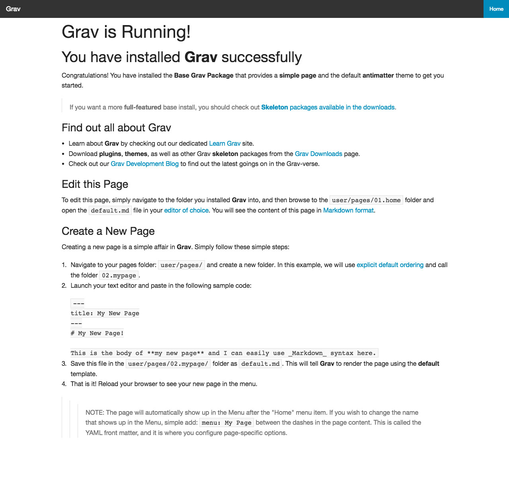

# Foundation

Foundation is a [Grav](http://getgrav.org) theme using Zurb's Foundation front-end framework.

# Installation

Installing the Foundation theme can be done in one of two ways. The GPM (Grav Package Manager) installation method enables you to quickly and easily install the theme with a simple terminal command, while the manual method enables you to do so via a zip file.

## GPM Installation (Preferred)

The simplest way to install this theme is via the [Grav Package Manager (GPM)](http://learn.getgrav.org/advanced/grav-gpm) through your system's Terminal (also called the command line).  From the root of your Grav install type:

    bin/gpm install foundation

This will install the Foundation theme into your `/user/themes` directory within Grav. Its files can be found under `/your/site/grav/user/themes/foundation`.

## Manual Installation

To install this theme, just download the zip version of this repository and unzip it under `/your/site/grav/user/themes`. Then, rename the folder to `foundation`. You can find these files either on [GitHub](https://github.com/brettdewoody/grav-theme-foundation) or via [GetGrav.org](http://getgrav.org/downloads/themes).

You should now have all the theme files under

    /your/site/grav/user/themes/foundation

>> NOTE: This theme is a modular component for Grav which requires the [AdvancedPageCache](https://github.com/getgrav/grav-plugin-advanced-pagecache) and [PreCache](https://github.com/getgrav/grav-plugin-precache) plugins.

To install the required plugins, from the root of your Grav install type:

    bin/gpm install advanced-pagecache
    bin/gpm install precache

# Updating

As development for the Foundation theme continues, new versions may become available that add additional features and functionality, improve compatibility with newer Grav releases, and generally provide a better user experience. Updating Antimatter is easy, and can be done through Grav's GPM system, as well as manually.

## GPM Update (Preferred)

The simplest way to update this theme is via the [Grav Package Manager (GPM)](http://learn.getgrav.org/advanced/grav-gpm). You can do this with this by navigating to the root directory of your Grav install using your system's Terminal (also called command line) and typing the following:

    bin/gpm update foundation

This command will check your Grav install to see if your Foundation theme is due for an update. If a newer release is found, you will be asked whether or not you wish to update. To continue, type `y` and hit enter. The theme will automatically update and clear Grav's cache.

## Manual Update

Manually updating Foundation is pretty simple. Here is what you will need to do to get this done:

* Delete the `your/site/user/themes/foundation` directory.
* Download the new version of the Foundation theme from either [GitHub](https://github.com/getgrav/grav-plugin-foundation) or [GetGrav.org](http://getgrav.org/downloads/themes#extras).
* Unzip the zip file in `your/site/user/themes` and rename the resulting folder to `foundation`.
* Clear the Grav cache. The simplest way to do this is by going to the root Grav directory in terminal and typing `bin/grav clear-cache`.

> Note: Any changes you have made to any of the files listed under this directory will also be removed and replaced by the new set. Any files located elsewhere (for example a YAML settings file placed in `user/config/themes`) will remain intact.

## Features

* Lightweight and minimal for optimal performance
* Fully responsive with off-page mobile navigation
* SCSS based CSS source files for easy customization
* Built-in support for on-page navigation
* Multiple page template types
* Fontawesome icon support

### Supported Page Templates

* Default view template
* Blog view template
* Error view template
* Blog item vew template
* Modular view templates:
  * Features Modular view template
  * Showcase Modular view template
  * Text Modular view template
* SnipCart view template

# Setup

If you want to set Foundation as the default theme, you can do so by following these steps:

* Navigate to `/your/site/grav/user/config`.
* Open the **system.yaml** file.
* Change the `theme:` setting to `theme: foundation`.
* Save your changes.
* Clear the Grav cache. The simplest way to do this is by going to the root Grav directory in Terminal and typing `bin/grav clear-cache`.

Once this is done, you should be able to see the new theme on the frontend. Keep in mind any customizations made to the previous theme will not be reflected as all of the theme and templating information is now being pulled from the **foundation** folder.

# Development Process

The Foundation theme includes a Gulp script to compile the SCSS into CSS. You'll need to install [NPM](https://www.npmjs.com/package/npm), [Bower](http://bower.io/) and [Gulp](http://gulpjs.com/) for this. If you have [NPM](https://www.npmjs.com/package/npm) installed this is pretty simple. From the Foundation theme directory (`/user/themes/foundation`), type the following:

    npm install --global gulp
    npm install --save-dev gulp
    npm install
    bower install

This will install all the required packages.

When in development you can run:

    gulp watch

to watch your SCSS files for changes and compile the CSS.
